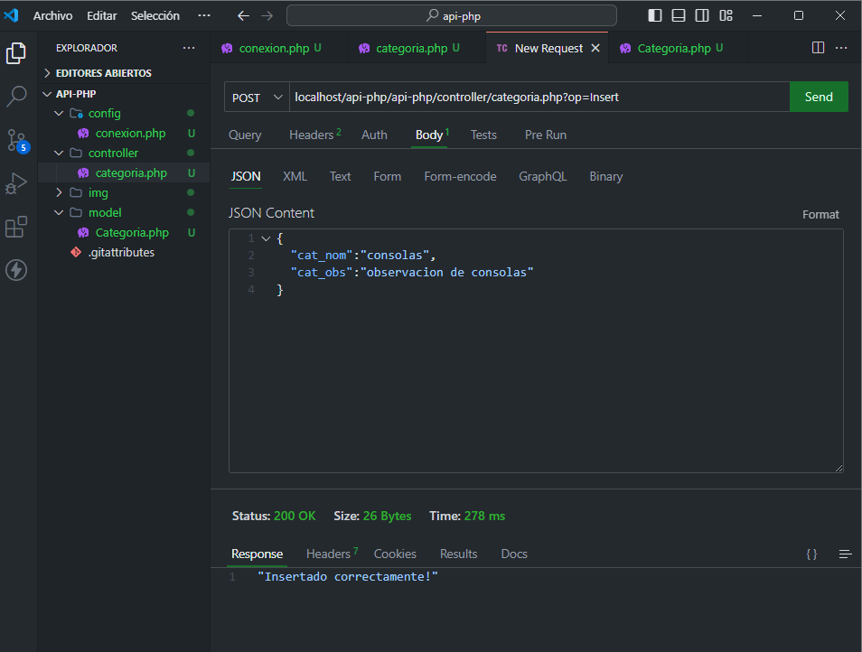

# API en PHP y MySQL

Este proyecto es una pequeña API desarrollada con **PHP** y **MySQL**. La API permite realizar operaciones CRUD (Crear, Leer, Actualizar y Eliminar) en una base de datos MySQL.

## Características
- CRUD completo sobre la base de datos.
- Conexión a MySQL utilizando PDO para mayor seguridad.
- Manejo de errores y excepciones.
- Respuestas en formato JSON.

## Imágenes del Proyecto

A continuación se muestran algunas capturas de pantalla:

1. **Solicitud GetAll:**
   

2. **Solicitud POST de inserción:**
   

3. **Solicitud POST con Postman:**
   

4. **Solicitud GetId:**
   

5. **Haciendo un Delete:**
   